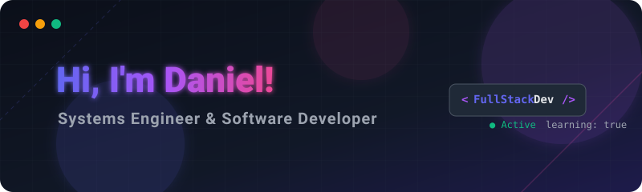

 

  

<table align="center" border="0" cellpadding="0" cellspacing="0" width="100%">
<tr>
<td valign="top" width="100%">
<table border="0" cellpadding="15" cellspacing="0" width="100%" bgcolor="#0d1117" style="border: 1px solid #30363d; border-radius: 8px;">
<tr>
<td>
🔴 🟡 🟢 &nbsp; <b>danielcanoh22 ~ skills</b>
  
<table align="center" border="0" cellpadding="0" cellspacing="8" width="100%">
<tr>
<td align="center" valign="top" width="33%">
<h3 align="center" style="color: #58a6ff;">Frontend</h3>
 

  

</td>
<td align="center" valign="top" width="33%">
<h3 align="center" style="color: #3ee581;">Backend</h3>
 

&nbsp;&nbsp;

</td>
<td align="center" valign="top" width="33%">
<h3 align="center" style="color: #ff7b72;">Others</h3>
 

</td>
</tr>
</table>
</td>
</tr>
</table>
</td>
</tr>
</table>

<!-- <h2 align="center" style="padding-bottom: 20px; margin-bottom: 20px;">🌱 Contacto</h2> -->

 

